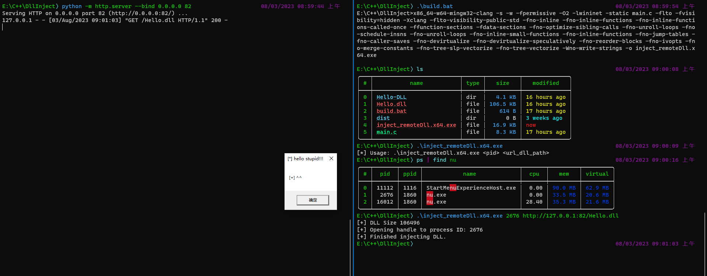

# inject_remoteDll
Download the remote dll and inject it into the target process for execution
This is not a new technology, I simply modified it for fun. It comes from the [BOF-DLL-Inject][https://github.com/tomcarver16/BOF-DLL-Inject], thanks [tomcarver16](https://github.com/tomcarver16)

## demo

